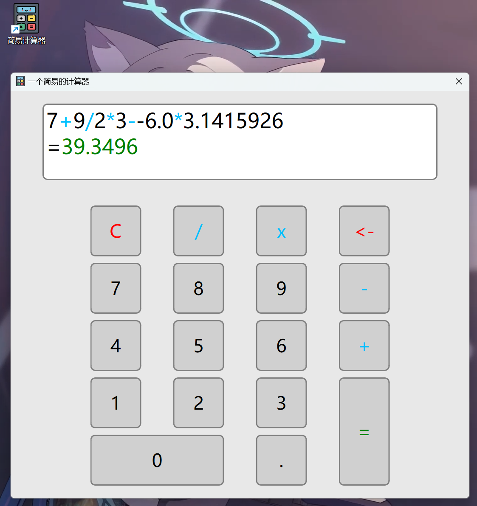

# Simple-Calculator

A simple GUI calculator based on Qt framework(functional perfection)

---

# 简单介绍

源码分别为main.cpp、widget.h、widget.cpp
该计算器的功能是仿照我手机上自带的简易计算器的功能做的，所有的逻辑实现均未参考其他人的任何思路

**~** 支持四则含负数的混合运算，
**~** 对用户的输入也有限制，比如不能连续输入两个运算符号、不能输入运算符号后直接等于、一个数字中不能输入两个以上的小数点等等
**~** 能识别减号和负号
（手机上也没有括号，再加个括号应该也不难）
......

（刚入门Qt两天翻文档做的，用代码的方式设计的界面，一些地方的写法可能不太成熟（比如信号与槽的连接），但逻辑实现和功能绝对没问题）

### 下面是预览图

